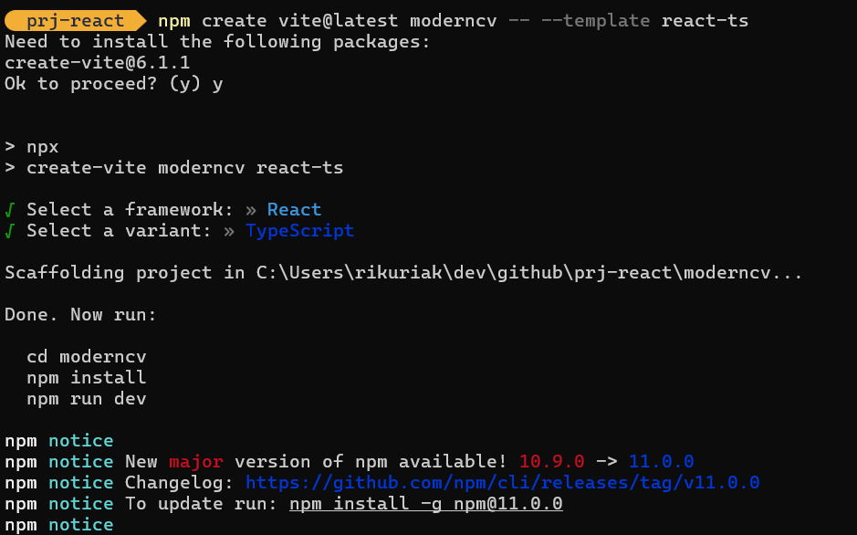

## prj-react
El objetivo de este proyecto es crear un curriculum vitae un poco mas moderno y simple que contenga los enlaces hacia cada proyecto para que puedan ver tu avance dentro de tu carrera.

Trataremos de documentar el paso a paso de este proyecto.

# opcion con npx

## 1. Crear un nuevo proyecto React
npx create-next-app@latest modern-cv --typescript --tailwind --eslint

## 2. Navegar al directorio
cd modern-cv

## 3. Instalar dependencias necesarias
npm install @radix-ui/react-slot lucide-react class-variance-authority clsx tailwind-merge
npm install @radix-ui/react-slot class-variance-authority clsx tailwind-merge
npm install @/components/ui/card
npm install @react-pdf/renderer
npm install -D @types/react-pdf

## 4. Iniciar el servidor de desarrollo
npm run dev

# opcion con vite

## 1. Crear un nuevo proyecto Vite con React y TypeScript
npm create vite@latest modern-cv -- --template react-ts

## 2. Navegar al directorio
cd modern-cv

## 3. Instalar dependencias base
npm install

## 4. Instalar dependencias adicionales necesarias
npm install lucide-react @react-pdf/renderer
npm install -D tailwindcss postcss autoprefixer
npm install clsx tailwind-merge class-variance-authority

## 5. Inicializar Tailwind CSS
npx tailwindcss init -p

## 6. Iniciar el servidor de desarrollo
npm run dev